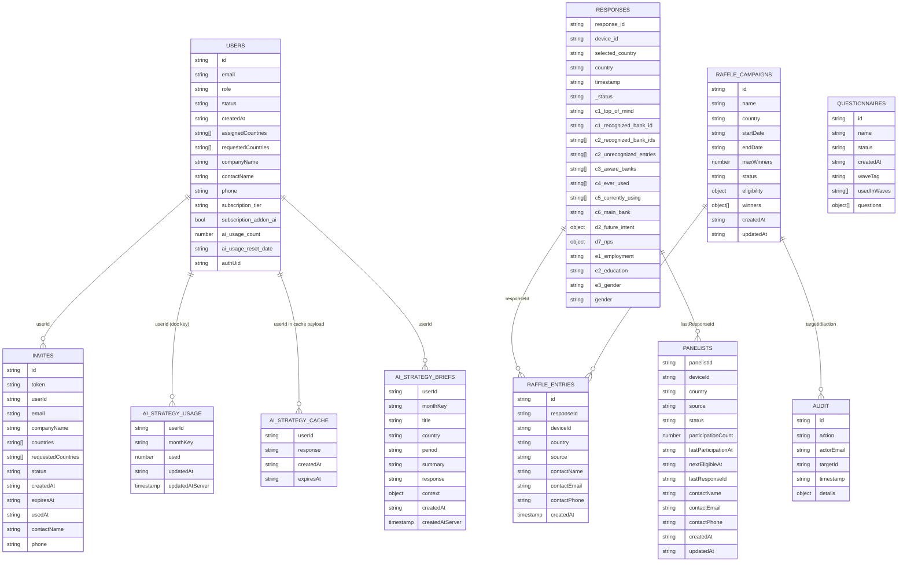

# Database Schema

## Overview
The app uses Firestore with a document-per-collection pattern. Most schema enforcement is implicit in TypeScript interfaces and write paths; Firestore itself has no server-side schema validation.

Primary collections observed in code:
- `users`
- `invites`
- `responses`
- `panelists`
- `questionnaires`
- `raffleEntries`
- `raffleCampaigns`
- `audit`
- `aiStrategyUsage`
- `aiStrategyCache`
- `aiStrategyBriefs`
- `config` (`bootstrap` document)

## Schema Diagram (Mermaid)

## Diagram Explanation
- Entities are Firestore collections observed in active service/page code paths.
- Relationship lines represent logical references (foreign-key-like fields), not enforced database constraints.
- Several references rely on semantic IDs (for example `response_id`) rather than Firestore document IDs.
- Derived analytics are computed at read time on the client and are intentionally excluded as stored entities.

## Relationships and ID Patterns
- `users` uses mixed ID strategy:
  - admins: doc id often Firebase UID
  - subscribers: doc id often email (`createDraftSubscriber`, `createSubscriberProfile`)
- `invites.userId` points to `users.id`
- `raffleEntries.responseId` references `responses.response_id` (not Firestore doc id)
- `panelists.lastResponseId` references `responses.response_id`
- AI usage legacy path also stores per-user/per-month document key (`{userId}_{month}`)

## Nested Objects / Computed Fields
- `responses.d2_future_intent` and `responses.d7_nps` are maps keyed by bank ID.
- `raffleCampaigns.eligibility` and `raffleCampaigns.winners[]` are nested structures.
- Derived analytics are computed client-side in `src/utils/subscriberDashboard.ts` and not stored as materialized views.

## Fields Written but Rarely/Never Read
- `responses._updatedAt` (written by report edit, no downstream read found).
- `users.lastLogin` set in auth context state but not persisted to Firestore.
- `users.authUid` written in `createSubscriberProfile`, not used in auth lookup logic.
- `panelists.createdAt` is rewritten on updates, reducing usefulness as immutable creation metadata.

## Fields Read but Not Reliably Written
- `responses.gender` is read heavily by dashboard filters/diagnostics; survey mainly writes `e3_gender`.
- `responses.c6_main_bank` and `responses.d5_committed` are assumed for downstream loyalty logic, but auto-skip assignment is not implemented when single-option paths are hidden.

## Likely Missing / Recommended Fields
- immutable `createdBy`/`updatedBy` on admin-mutated collections
- `version`/`schemaVersion` on response payloads
- normalized `userUid` foreign key on all user-owned docs
- explicit `submittedAt` server timestamp for responses (currently client ISO)

## Inconsistent Naming
- `gender` vs `e3_gender`
- `country` vs `selected_country`
- `c6_main_bank` vs `c6_often_used` (both used in logic)
- timestamps mixed between ISO strings and Firestore timestamps

## Schema Risks / Integrity Issues
- Mixed user ID strategy (email vs UID) increases join/auth complexity.
- Heavy reliance on optional fields with no schema validation.
- Client-generated timestamps and IDs can be forged or malformed.
- No transaction boundaries for multi-document operations except initial admin bootstrap.
- Public write surfaces can create noisy/invalid records.

## Assumptions
- No hidden migration scripts beyond repository scripts folder.
- Existing production data may contain legacy field variants from older flows.

## Known Gaps / Unclear Areas
- No `firestore.indexes.json` present; current queries appear to rely on default indexes only.
- Some localStorage-only stores (`adminStore`, `raffleStore`) appear legacy and disconnected from Firestore truth.
- Seed/test scripts write schema variants that differ from current survey output.

## Recommended Improvements
- Standardize identity foreign keys (`uid` + stable profile id).
- Add runtime schema validation on writes (Zod or server function layer).
- Normalize demographic and country fields to one canonical key each.
- Add migration utility for historical response shape cleanup.
- Introduce server-side write API for critical collections to enforce schema and ownership.
