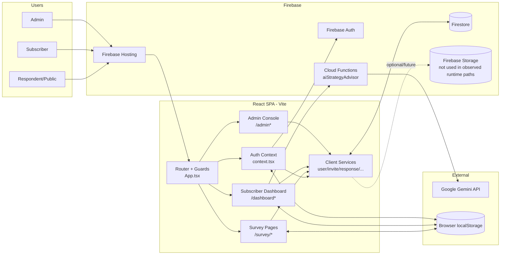

# System Architecture

## Overview
This repository is a single-page React application (Vite + TypeScript) backed by Firebase services.

- Frontend: one web app serving public survey, subscriber dashboard, and admin console via route/role guards.
- Data layer: Firestore is accessed directly from client-side services (`src/services/*`).
- Auth: Firebase Authentication, with role/status resolved from Firestore `users` docs.
- Backend: one Firebase Callable Function (`aiStrategyAdvisor`) for Gemini-based strategy responses.
- Hosting: Firebase Hosting serves SPA with rewrite to `index.html`.

## Architecture Diagram (Mermaid)

## User Roles + Route Boundaries
- Public respondent:
  - `/`, `/survey/:country`, `/survey/:country/:wave`
- Admin:
  - `/admin`, `/admin/users`, `/admin/subscribers`, `/admin/questionnaires`, `/admin/panels`, `/admin/reports`, `/admin/aliases`, `/admin/raffles`, `/admin/unrecognized`
- Subscriber:
  - `/dashboard`, `/dashboard/:country`, `/dashboard/reports`, `/dashboard/pending`

Role enforcement is in client guards (`RequireAuth`, `RequireRole`) and depends on Firestore user profile fields (`role`, `status`).

## Diagram Explanation
- All roles use the same SPA and route-level guard logic.
- Frontend services call Firestore directly for most domain operations.
- Function invocation is limited to AI strategy generation; this is the only backend compute path in current code.
- Firebase Storage is included to represent the platform boundary but is not integrated in active feature flows.

## Data Flow Notes
1. Auth state initializes via Firebase Auth, then `users` lookup by email.
2. Most writes/reads happen directly from browser to Firestore through `src/services/*.ts`.
3. Survey completion writes local copy (`utils/storage.ts`) and Firestore copy (`responseService.addResponse`).
4. AI Strategy Advisor flow:
   - Dashboard builds structured payload from computed metrics.
   - Calls `httpsCallable(functions, 'aiStrategyAdvisor')`.
   - Function calls Gemini API using `GEMINI_API_KEY` secret.
   - Result cached/usage-tracked in Firestore (`aiStrategyCache`, `aiStrategyUsage`, `users.ai_usage_count`) and localStorage fallback.

## Third-Party / External Integrations
- Firebase Auth / Firestore / Functions / Hosting
- Google Gemini API (via Firebase Function)
- Browser-only localStorage usage for draft/session/cache/state fallback

## Assumptions
- No additional backend outside Firebase Function in this repo.
- No payment gateway integration found.
- No Cloud Storage usage found in implementation paths.

## Known Gaps / Unclear Areas
- Firestore security rules are permissive and do not align with intended role boundaries.
- AI feature can be intentionally disabled by default through `VITE_AI_ADVISOR_PLACEHOLDER`.
- Some legacy modules appear unused (`src/components/admin/tabs/*`, `src/auth/adminStore.ts`, `src/utils/raffleStore.ts`).
- Subscriber reports route exists but page is scaffold-only.

## Recommended Improvements
- Move sensitive admin/business writes to server-side callable/HTTP functions.
- Enforce RBAC in Firestore rules and function-level authorization.
- Reduce monolithic dashboard size by extracting feature modules.
- Add explicit architecture ADRs for role model, data ownership, and trust boundaries.
